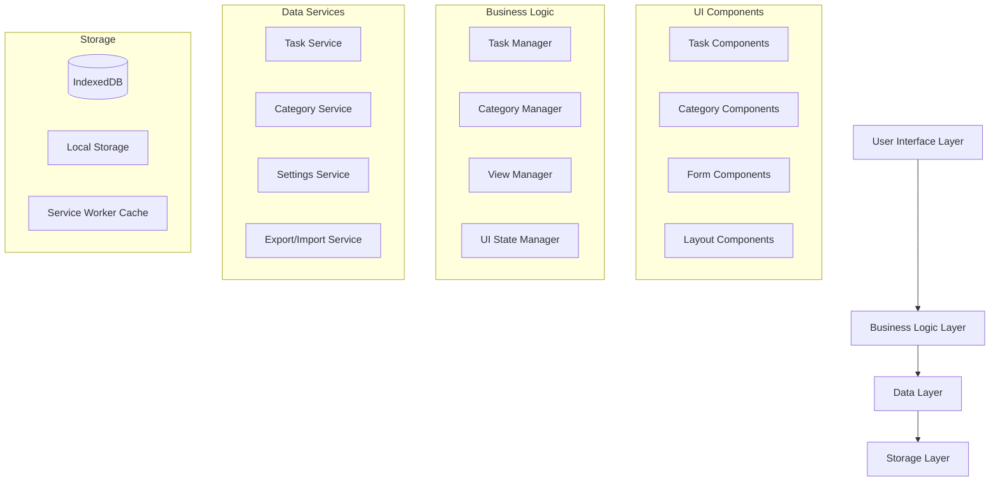

# How Long Since App - Design Document

## Overview

The "How Long Since" application is designed as a mobile-first, accessibility-compliant task management system built with Next.js 15, React 19, and Mantine v8. The application follows a local-first architecture using IndexedDB for data persistence, ensuring full offline functionality without requiring user authentication.

The core design philosophy centers on reducing cognitive load by tracking "when" rather than "what" - focusing on time elapsed since task completion rather than traditional due dates or to-do lists.

## Architecture

### High-Level Architecture



### Technology Stack

- **Frontend Framework**: Next.js 15 with App Router
- **UI Library**: Mantine v8 with custom theme
- **State Management**: React Context + useReducer for complex state
- **Data Storage**: IndexedDB via Dexie.js wrapper
- **Styling**: Mantine's CSS-in-JS with custom theme tokens
- **Icons**: Tabler Icons (already included)
- **PWA**: Next.js PWA plugin with service worker
- **Testing**: Jest + React Testing Library + axe-core for accessibility

### Folder Structure

```
src/
├── app/                          # Next.js App Router
│   ├── layout.tsx               # Root layout with providers
│   ├── page.tsx                 # Main task list page
│   ├── settings/                # Settings pages
│   └── globals.css              # Global styles
├── components/                   # Reusable UI components
│   ├── ui/                      # Base UI components
│   │   ├── Button/
│   │   ├── Card/
│   │   ├── Modal/
│   │   └── index.ts
│   ├── task/                    # Task-related components
│   │   ├── TaskCard/
│   │   ├── TaskForm/
│   │   ├── TaskList/
│   │   └── index.ts
│   ├── category/                # Category components
│   │   ├── CategoryBadge/
│   │   ├── CategoryForm/
│   │   └── index.ts
│   ├── layout/                  # Layout components
│   │   ├── AppShell/
│   │   ├── Navigation/
│   │   └── index.ts
│   └── forms/                   # Form components
├── hooks/                       # Custom React hooks
│   ├── useTaskManager.ts
│   ├── useCategoryManager.ts
│   ├── useLocalStorage.ts
│   └── useAccessibility.ts
├── lib/                         # Utility functions and services
│   ├── db/                      # Database layer
│   │   ├── schema.ts
│   │   ├── migrations.ts
│   │   └── index.ts
│   ├── services/                # Business logic services
│   │   ├── TaskService.ts
│   │   ├── CategoryService.ts
│   │   ├── SettingsService.ts
│   │   └── ExportService.ts
│   ├── utils/                   # Utility functions
│   │   ├── dateUtils.ts
│   │   ├── validationUtils.ts
│   │   └── accessibilityUtils.ts
│   └── constants/               # App constants
│       ├── categories.ts
│       ├── timeCommitments.ts
│       └── themes.ts
├── types/                       # TypeScript type definitions
│   ├── task.ts
│   ├── category.ts
│   ├── settings.ts
│   └── index.ts
├── contexts/                    # React contexts
│   ├── TaskContext.tsx
│   ├── CategoryContext.tsx
│   ├── SettingsContext.tsx
│   └── AccessibilityContext.tsx
└── styles/                      # Style-related files
    ├── theme.ts                 # Mantine theme customization
    └── globals.css              # Global CSS
```

## Components and Interfaces

### Core Data Models

```typescript
// Task Entity
interface Task {
  id: string;
  name: string;
  description: string;
  categoryId: string;
  createdAt: Date;
  lastCompletedAt: Date | null;
  expectedFrequency?: {
    value: number;
    unit: 'day' | 'week' | 'month' | 'year';
  };
  timeCommitment?: '15min' | '30min' | '1hr' | '2hrs' | '4hrs' | '5hrs+';
  isArchived: boolean;
  notes: string;
}

// Category Entity
interface Category {
  id: string;
  name: string;
  color: string;
  icon?: string;
  isDefault: boolean;
  order: number;
}

// App Settings Entity
interface AppSettings {
  id: string;
  lastBackupDate: Date | null;
  currentView: 'category' | 'time';
  theme: 'light' | 'dark' | 'system';
  textSize: 'default' | 'large' | 'larger';
  highContrast: boolean;
  reducedMotion: boolean;
  onboardingCompleted: boolean;
}
```

### Key Component Interfaces

```typescript
// Task Card Component
interface TaskCardProps {
  task: Task;
  category: Category;
  onComplete: (taskId: string) => void;
  onEdit: (taskId: string) => void;
  onArchive: (taskId: string) => void;
  showCategory?: boolean;
  compact?: boolean;
}

// Task Form Component
interface TaskFormProps {
  task?: Task;
  categories: Category[];
  onSubmit: (task: Partial<Task>) => void;
  onCancel: () => void;
  mode: 'create' | 'edit';
}

// Task List Component
interface TaskListProps {
  tasks: Task[];
  categories: Category[];
  viewMode: 'category' | 'time';
  onTaskComplete: (taskId: string) => void;
  onTaskEdit: (taskId: string) => void;
  onTaskArchive: (taskId: string) => void;
  loading?: boolean;
  emptyState?: React.ReactNode;
}
```

### Service Layer Interfaces

```typescript
// Task Service
interface TaskService {
  getAllTasks(): Promise<Task[]>;
  getTaskById(id: string): Promise<Task | null>;
  createTask(task: Omit<Task, 'id' | 'createdAt'>): Promise<Task>;
  updateTask(id: string, updates: Partial<Task>): Promise<Task>;
  deleteTask(id: string): Promise<void>;
  archiveTask(id: string): Promise<Task>;
  completeTask(id: string): Promise<Task>;
  getTasksByCategory(categoryId: string): Promise<Task[]>;
  getOverdueTasks(): Promise<Task[]>;
}

// Category Service
interface CategoryService {
  getAllCategories(): Promise<Category[]>;
  getCategoryById(id: string): Promise<Category | null>;
  createCategory(category: Omit<Category, 'id'>): Promise<Category>;
  updateCategory(id: string, updates: Partial<Category>): Promise<Category>;
  deleteCategory(id: string): Promise<void>;
  getDefaultCategories(): Category[];
}
```

## Data Models

### Database Schema (IndexedDB)

```typescript
// Database Schema using Dexie
class HowLongSinceDB extends Dexie {
  tasks!: Table<Task>;
  categories!: Table<Category>;
  settings!: Table<AppSettings>;

  constructor() {
    super('HowLongSinceDB');
    
    this.version(1).stores({
      tasks: '++id, name, categoryId, lastCompletedAt, isArchived, createdAt',
      categories: '++id, name, isDefault, order',
      settings: '++id'
    });
  }
}
```

### Data Validation Schemas

```typescript
// Using Zod for runtime validation
const TaskSchema = z.object({
  id: z.string().uuid(),
  name: z.string().min(1).max(128),
  description: z.string().max(512),
  categoryId: z.string().uuid(),
  createdAt: z.date(),
  lastCompletedAt: z.date().nullable(),
  expectedFrequency: z.object({
    value: z.number().positive(),
    unit: z.enum(['day', 'week', 'month', 'year'])
  }).optional(),
  timeCommitment: z.enum(['15min', '30min', '1hr', '2hrs', '4hrs', '5hrs+']).optional(),
  isArchived: z.boolean(),
  notes: z.string().max(512)
});

const CategorySchema = z.object({
  id: z.string().uuid(),
  name: z.string().min(1).max(50),
  color: z.string().regex(/^#[0-9A-F]{6}$/i),
  icon: z.string().optional(),
  isDefault: z.boolean(),
  order: z.number().int().min(0)
});
```

## Error Handling

### Error Types and Handling Strategy

```typescript
// Custom Error Types
class TaskValidationError extends Error {
  constructor(field: string, message: string) {
    super(`Validation error in ${field}: ${message}`);
    this.name = 'TaskValidationError';
  }
}

class StorageError extends Error {
  constructor(operation: string, cause?: Error) {
    super(`Storage operation failed: ${operation}`);
    this.name = 'StorageError';
    this.cause = cause;
  }
}

class ImportError extends Error {
  constructor(message: string, lineNumber?: number) {
    super(lineNumber ? `Import error at line ${lineNumber}: ${message}` : `Import error: ${message}`);
    this.name = 'ImportError';
  }
}

// Error Boundary Component
interface ErrorBoundaryState {
  hasError: boolean;
  error?: Error;
  errorInfo?: ErrorInfo;
}

class TaskErrorBoundary extends Component<PropsWithChildren, ErrorBoundaryState> {
  // Implementation with user-friendly error messages and recovery options
}
```

### Error Recovery Strategies

1. **Validation Errors**: Show inline form errors with specific guidance
2. **Storage Errors**: Retry with exponential backoff, offer offline mode
3. **Import Errors**: Show detailed error report with line numbers and suggestions
4. **Network Errors**: Graceful degradation to offline mode
5. **Unexpected Errors**: Error boundary with recovery options and bug reporting

## Testing Strategy

### Testing Pyramid

```typescript
// Unit Tests (70%)
describe('TaskService', () => {
  it('should create task with valid data', async () => {
    // Test task creation logic
  });
  
  it('should validate task data before saving', async () => {
    // Test validation logic
  });
  
  it('should calculate overdue status correctly', () => {
    // Test business logic
  });
});

// Integration Tests (20%)
describe('Task Management Flow', () => {
  it('should create, complete, and archive task', async () => {
    // Test full user workflow
  });
  
  it('should handle category changes', async () => {
    // Test category management integration
  });
});

// E2E Tests (10%)
describe('User Workflows', () => {
  it('should complete onboarding and create first task', () => {
    // Test complete user journey
  });
  
  it('should work offline', () => {
    // Test PWA functionality
  });
});
```

### Accessibility Testing Strategy

```typescript
// Automated Accessibility Tests
describe('Accessibility', () => {
  it('should have no axe violations', async () => {
    const { container } = render(<TaskList tasks={mockTasks} />);
    const results = await axe(container);
    expect(results).toHaveNoViolations();
  });
  
  it('should support keyboard navigation', () => {
    // Test keyboard interaction
  });
  
  it('should announce state changes to screen readers', () => {
    // Test ARIA live regions
  });
});
```

## User Interface Design

### Design System Implementation

```typescript
// Custom Mantine Theme
const theme = createTheme({
  colors: {
    primary: [
      '#eff6ff', '#dbeafe', '#bfdbfe', '#93c5fd', 
      '#60a5fa', '#3b82f6', '#2563eb', '#1d4ed8', 
      '#1e40af', '#1e3a8a'
    ],
    success: [
      '#f0fdf4', '#dcfce7', '#bbf7d0', '#86efac',
      '#4ade80', '#22c55e', '#16a34a', '#15803d',
      '#166534', '#14532d'
    ],
    warning: [
      '#fffbeb', '#fef3c7', '#fde68a', '#fcd34d',
      '#fbbf24', '#f59e0b', '#d97706', '#b45309',
      '#92400e', '#78350f'
    ],
    danger: [
      '#fef2f2', '#fecaca', '#fca5a5', '#f87171',
      '#ef4444', '#dc2626', '#b91c1c', '#991b1b',
      '#7f1d1d', '#6b1d1d'
    ]
  },
  fontFamily: 'Inter, -apple-system, BlinkMacSystemFont, Segoe UI, Roboto, sans-serif',
  headings: {
    fontFamily: 'Inter, -apple-system, BlinkMacSystemFont, Segoe UI, Roboto, sans-serif',
    sizes: {
      h1: { fontSize: '2rem', lineHeight: '1.2', fontWeight: '700' },
      h2: { fontSize: '1.5rem', lineHeight: '1.3', fontWeight: '600' },
      h3: { fontSize: '1.25rem', lineHeight: '1.4', fontWeight: '600' }
    }
  },
  spacing: {
    xs: '0.5rem',
    sm: '0.75rem',
    md: '1rem',
    lg: '1.5rem',
    xl: '2rem'
  },
  radius: {
    xs: '0.25rem',
    sm: '0.375rem',
    md: '0.5rem',
    lg: '0.75rem',
    xl: '1rem'
  }
});
```

### Component Design Patterns

```typescript
// Task Card Component Design
const TaskCard = ({ task, category, onComplete, onEdit }: TaskCardProps) => {
  const timeElapsed = useTimeElapsed(task.lastCompletedAt);
  const isOverdue = useOverdueStatus(task);
  
  return (
    <Card
      shadow="sm"
      padding="md"
      radius="md"
      withBorder
      className={clsx(
        'task-card',
        isOverdue && 'task-card--overdue'
      )}
      style={{
        borderLeftColor: category.color,
        borderLeftWidth: '4px'
      }}
    >
      <Group justify="space-between" align="flex-start">
        <Stack gap="xs" flex={1}>
          <Group gap="xs" align="center">
            <Text size="lg" fw={500} lineClamp={2}>
              {task.name}
            </Text>
            {isOverdue && (
              <ThemeIcon
                size="sm"
                color="red"
                variant="light"
                aria-label="Overdue task"
              >
                <IconAlertCircle size={16} />
              </ThemeIcon>
            )}
          </Group>
          
          <Group gap="sm" align="center">
            <CategoryBadge category={category} size="sm" />
            <Text size="sm" c="dimmed">
              {timeElapsed}
            </Text>
            {task.timeCommitment && (
              <TimeCommitmentBadge commitment={task.timeCommitment} />
            )}
          </Group>
        </Stack>
        
        <ActionIcon
          size="lg"
          variant="light"
          color="green"
          onClick={() => onComplete(task.id)}
          aria-label={`Mark "${task.name}" as complete`}
        >
          <IconCheck size={20} />
        </ActionIcon>
      </Group>
    </Card>
  );
};
```

### Responsive Design Strategy

```typescript
// Responsive Layout Hook
const useResponsiveLayout = () => {
  const theme = useMantineTheme();
  const [screenSize, setScreenSize] = useState<'mobile' | 'tablet' | 'desktop'>('mobile');
  
  useEffect(() => {
    const updateScreenSize = () => {
      const width = window.innerWidth;
      if (width < theme.breakpoints.sm) {
        setScreenSize('mobile');
      } else if (width < theme.breakpoints.lg) {
        setScreenSize('tablet');
      } else {
        setScreenSize('desktop');
      }
    };
    
    updateScreenSize();
    window.addEventListener('resize', updateScreenSize);
    return () => window.removeEventListener('resize', updateScreenSize);
  }, [theme.breakpoints]);
  
  return {
    screenSize,
    isMobile: screenSize === 'mobile',
    isTablet: screenSize === 'tablet',
    isDesktop: screenSize === 'desktop',
    columns: screenSize === 'mobile' ? 1 : screenSize === 'tablet' ? 2 : 3
  };
};
```

## Accessibility Implementation

### ARIA Implementation Strategy

```typescript
// Accessibility Context
interface AccessibilityContextType {
  announceToScreenReader: (message: string) => void;
  focusElement: (elementId: string) => void;
  highContrast: boolean;
  reducedMotion: boolean;
  textSize: 'default' | 'large' | 'larger';
}

// Screen Reader Announcements
const useScreenReaderAnnouncements = () => {
  const announceRef = useRef<HTMLDivElement>(null);
  
  const announce = useCallback((message: string) => {
    if (announceRef.current) {
      announceRef.current.textContent = message;
      // Clear after announcement
      setTimeout(() => {
        if (announceRef.current) {
          announceRef.current.textContent = '';
        }
      }, 1000);
    }
  }, []);
  
  return {
    announce,
    AnnouncementRegion: () => (
      <div
        ref={announceRef}
        aria-live="polite"
        aria-atomic="true"
        className="sr-only"
      />
    )
  };
};
```

### Keyboard Navigation Implementation

```typescript
// Keyboard Navigation Hook
const useKeyboardNavigation = (items: string[], onSelect: (id: string) => void) => {
  const [focusedIndex, setFocusedIndex] = useState(0);
  
  const handleKeyDown = useCallback((event: KeyboardEvent) => {
    switch (event.key) {
      case 'ArrowDown':
        event.preventDefault();
        setFocusedIndex(prev => Math.min(prev + 1, items.length - 1));
        break;
      case 'ArrowUp':
        event.preventDefault();
        setFocusedIndex(prev => Math.max(prev - 1, 0));
        break;
      case 'Enter':
      case ' ':
        event.preventDefault();
        onSelect(items[focusedIndex]);
        break;
      case 'Home':
        event.preventDefault();
        setFocusedIndex(0);
        break;
      case 'End':
        event.preventDefault();
        setFocusedIndex(items.length - 1);
        break;
    }
  }, [items, focusedIndex, onSelect]);
  
  return {
    focusedIndex,
    handleKeyDown,
    focusedId: items[focusedIndex]
  };
};
```

## Performance Optimization

### Code Splitting Strategy

```typescript
// Lazy Loading Components
const TaskForm = lazy(() => import('../components/task/TaskForm'));
const SettingsPage = lazy(() => import('../app/settings/page'));
const ExportImportModal = lazy(() => import('../components/ExportImportModal'));

// Route-based Code Splitting
const routes = [
  {
    path: '/',
    component: lazy(() => import('../app/page'))
  },
  {
    path: '/settings',
    component: lazy(() => import('../app/settings/page'))
  }
];
```

### Data Optimization

```typescript
// Virtual Scrolling for Large Lists
const VirtualTaskList = ({ tasks }: { tasks: Task[] }) => {
  const { height } = useViewportSize();
  const itemHeight = 120; // Estimated task card height
  const visibleCount = Math.ceil(height / itemHeight) + 2; // Buffer
  
  const [scrollTop, setScrollTop] = useState(0);
  const startIndex = Math.floor(scrollTop / itemHeight);
  const endIndex = Math.min(startIndex + visibleCount, tasks.length);
  
  const visibleTasks = tasks.slice(startIndex, endIndex);
  
  return (
    <ScrollArea
      style={{ height }}
      onScrollPositionChange={({ y }) => setScrollTop(y)}
    >
      <div style={{ height: tasks.length * itemHeight, position: 'relative' }}>
        <div
          style={{
            transform: `translateY(${startIndex * itemHeight}px)`,
            position: 'absolute',
            top: 0,
            left: 0,
            right: 0
          }}
        >
          {visibleTasks.map((task, index) => (
            <TaskCard
              key={task.id}
              task={task}
              style={{ height: itemHeight }}
            />
          ))}
        </div>
      </div>
    </ScrollArea>
  );
};
```

### Caching Strategy

```typescript
// Service Worker Caching
const CACHE_NAME = 'how-long-since-v1';
const STATIC_ASSETS = [
  '/',
  '/static/js/bundle.js',
  '/static/css/main.css',
  '/manifest.json'
];

// Cache-first strategy for static assets
// Network-first strategy for API calls
// Stale-while-revalidate for task data
```

This design document provides a comprehensive foundation for implementing the "How Long Since" application. The architecture emphasizes accessibility, performance, and maintainability while staying true to the core requirements of reducing cognitive load and providing an intuitive task management experience.